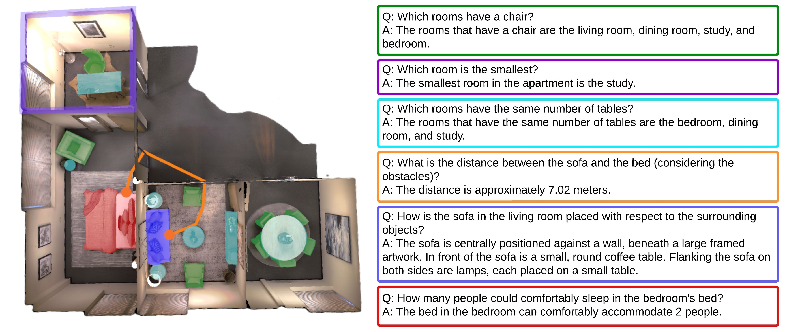
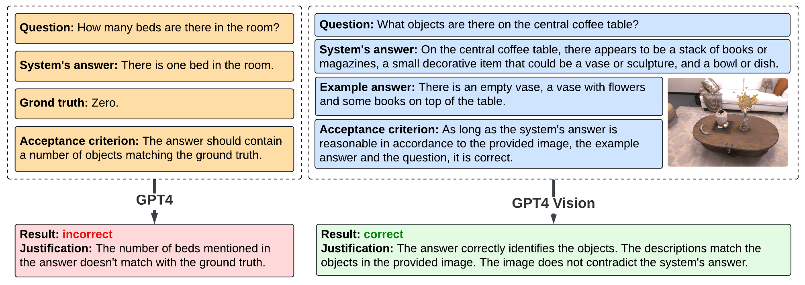

<p align="center">
<h1 align="center"><strong>Space3D-Bench: Spatial 3D Question Answering Benchmark</strong></h1>
  <p align="center">
    <a href="https://emilia-szymanska.gitlab.io/cv/" target="_blank">Emilia Szymanska</a>&emsp;
    <a href="https://dusmanu.com/" target="_blank">Mihai Dusmanu</a>&emsp;
    <a href="https://jwbuurlage.github.io/" target="_blank">Jan-Willem Buurlage</a>&emsp;
    <a href="https://radmahdi.github.io/" target="_blank">Mahdi Rad</a>&emsp;
    <a href="https://people.inf.ethz.ch/pomarc/" target="_blank">Marc Pollefeys</a>&emsp;
    <br>
    ETH Zurich&emsp;Microsoft, Zurich
    <br>
    <strong>ECCV 2024 Workshop</strong>
  </p>
</p>


<p align="center">
  <a href="https://arxiv.org/abs/2408.16662" target='_**blank**' disabled>
    
  </a> 
  <a href="https://arxiv.org/pdf/2408.16662" target='_blank' disabled>
    
  </a> 
  <a href="https://space3d-bench.github.io/" target='_blank'>
    
  </a>
</p>


<div style="text-align: center;">
    
</div>


<p align="justify"> We present <b>Space3D-Bench</b> - a collection of 1000 general spatial questions and answers related to scenes of the Replica dataset which offers a variety of data modalities: point clouds, posed RGB-D images, navigation meshes and 3D object detections. To ensure that the questions cover a wide range of 3D objectives, we propose an indoor spatial questions taxonomy inspired by geographic information systems and use it to balance the dataset accordingly. Moreover, we provide an assessment system that grades natural language responses based on predefined ground-truth answers by leveraging a Vision Language Model's comprehension of both text and images to compare the responses with ground-truth textual information or relevant visual data. </p>

## 📋 Content

### Released dataset format

The Space3D-Bench dataset - that you may download in the way described in `Getting Started` section - contains 13 directories with data corresponding to the same-named scenes in the <a href="https://github.com/facebookresearch/Replica-Dataset/">Replica dataset</a>. Each directory has the following structure
```
├── img
    ├── qX.png
    ├── qY.png
    ...
├── misc
    ├── detections.json 
    ├── navmesh.txt
├── ground_truth.json
├── questions.json
```

The `img` directory contains image files, which - combined with `ground_truth.json` - are used as a scene context for the evaluation (further explained in `Evaluation` section). The questions (with the corresponding question number) are present in `questions.json` file.

There are two auxiliary files in the `misc` directory. One of them - `detections.json` - is the improvement of the object detections provided by Replica. We assigned objects to specific rooms, and we proposes the 3D centers and dimensions of each room. We additionally added some classes such as mirror, toy for bigger objects that were marked as "undefined" in Replica. We kept the objects ids, centers, sizes and rotations, removed the classes we found irrelevant (such as "undefined", "other-lead"), and moved the 3D centers from Habitat-Sim's coordinate system to the Replica one.

The other file we included, `navmesh.txt`, is the navigation mesh of the environment. Replica provides one, but it is in a binary format, contains some artifacts and is expressed in Habitat-Sim's coordinate system. We addressed these points, and release a library-independent text file with definitions of vertices and triangles forming the mesh. 

### Scripts

In terms of scripts - used for evaluation of the answering system responses - the repository contains the following files: 
- `core/abstract_llm.py`: LLM-related interfaces, used for answer evaluation with the to-be-implemented methods;
-  `core/example_llm.py`: an example of the implementation of the LLM interfaces, with calls to Azure OpenAI services and Azure Identity authentication;
- `core/prompts.py`: prompts used when calling LLMs;
- `core/scene.py`: enum class, containing scene names and their corresponding folder names as values;
- `eval.py`: script used to evaluate the answers from a spatial QA system with respect to the scene context.


## 🚀 Getting Started

### Environment

1. Download the repository.
    ```bash
    git clone https://github.com/Space3D-Bench/Space3D-Bench.git
    cd Space3D-Bench
    ```
2. Prepare your python virtual environment (example shown for conda).
    ```bash
    conda create -n your_env_name python=3.10
    conda activate your_env_name
    ```
3. Install the requirements.
    ```bash
    pip install -r requirements.txt
    ```

### Data

1. Download the dataset and place it in the repository (you may alternatively <a href="https://github.com/Space3D-Bench/Space3D-Bench/releases/download/v0.0.1/data.zip">download it in the browser</a> and place it manually in the repository):
    ```bash
    wget https://github.com/Space3D-Bench/Space3D-Bench/releases/download/v0.0.1/data.zip
    unzip data.zip -d path/to/the/Space3D-Bench/repository
    rm data.zip
    ```
2. Run the questions from data/SCENE_NAME/questions.json on your Q&A system, using Replica dataset data and our proposed curated detections with navigation meshes (described in the `Content` section). The question-containing file has the keys being the question numbers and values being the actual questions:

    ```json
    {
        "1": "How many chairs are there in the room?",
        "2": "How are the sofa and the armchair placed with respect to each other?",
    }
    ```

    Keep saving the responses from your system to a JSON file in the following format:

    ```json
    {
        "1": "There are 5 chairs.",
        "2": "The objects are standing on the opposite sides of a coffee table, facing one another.",
    }
    ```

    <b>Important!!!</b> In navigation-related questions, the answer should contain either the ids or 3D positions (in the Replica coordinate system) of the objects between which the distance was calculated.
    
3. Place the responses-containing JSON files as the corresponding `data/SCENE_NAME/answers.json` (you may choose another name, but then update the line 49 in `eval.py` accordingly).

### LLM calls

Depending on the way you receive responses from an LLM that would be used for answers evaluation, you may need to adjust the scripts. Implement two classes, inheriting from `AbstractTextLLM` and `AbstractVisionLLM` classes in `core/abstract_llm.py`, for text-focused and vision-related Large Language Models respectively. We provide example implementations in `core/example_llm.py`, where we use API calls to Azure OpenAI services with Azure Identity authentication to get responses from the models. Then, move to `eval.py` and update the object creation accordingly in lines 26-37. In our case, we create our example objects with the settings from `.env` file having the following format:
```
ENDPOINT="..."
API_VERSION="..."
VISION_DEPLOYMENT="..."
TEXT_DEPLOYMENT="..."
```

We used `2024-02-15-preview` version, `gpt-4-0613` as a text LLM and `gpt-4-vision-preview` for image-related tasks. 

## 🔍 Evaluation

### Automatic assessment explanation

<p align="justify"> The goal of the automatic assessment is to evaluate the responses from an answering system with respect to the actual state of the corresponding scene in the dataset. We divided the assessment into two cases: Ground Truth Check - when the ground truth is indisputable (e.g. number of objects in the room), Answer Cross-check - when the definition of the ground truth would either need to exceed context length or would unnecessarily limit the answering system's creativity (e.g. finding similarities between rooms). In both scenarios, an LLM is provided with the question, the system's answer, and the acceptance criterion, which varies based on the question type. In the case of the Ground Truth Check, the message to the LLM is extended with information on the actual state of the scene with respect to the given question. Answer Cross-check, however, provides an image presenting the corresponding scene(s) in question, accompanied by an example answer. This way, a VLM can decide whether the actual system's answer matches the reality, and not necessarily matching the example, reducing the bias of the assessment system. </p>


<div style="text-align: center;">
    
</div>

### Scene context

The answers from a question answering system are assessed with respect to the scene context. The scene context is provided in a form of a JSON file `data/SCENE_NAME/ground_truth.json`, which for each question number defines a prompt being the acceptance criterion, and the answer that the system should return. The answer can be provided in two manners:
- ground truth information for indisputable facts, in form of a text:

    <i><b>Q1. How many chairs are there in the room?</b></i>
    ```json
    "1": {
        "answer": "Number of objects: 6",
        "prompt": "The answer should contain a number of objects matching the ground truth."
    },
    ```
- image with an example answer for more creative responses, in a form of a corresponding image path and an example text:

    <i><b>Q2. How are the sofa and the armchair placed with respect to each other?</b></i>
    ```json
    "2": {
        "answer": {
            "image_path": "data/scene_name/img/q2.png",
            "example_answer": "The sofa and the armchair are facing each other, separated by a coffee table."
        },
        "prompt": "You are provided with an image, presenting the object(s) described in the question. If  the image is divided into two parts with a red vertical line, the two parts correspond to the different views of the same scene. Decide whether the answer on the objects spatial relationship is correct based on the provided image. An example of the correct answer is provided as well, however, the actual answer does not need to fully match the example answer. As long as it is reasonable in accordance to the image, the example answer and the question, it is correct. If the answer is vague, but still correct in a sense, accept it."
    },
    ```

### Running

Once the preparation steps descibed in `Setup` sections are done, simply run the `eval.py` file from within your environment:
```bash
cd path/to/Space3D-Bench/repo
python eval.py
```

The assessment results will be incrementally saved to `data/SCENE_NAME/result.json`. In case the evaluation is interrupted, you can rerun the script and it will skip the questions for which the assessment decision is already present in the result JSON. The script will also skip the scenes for which the `answers.json` file does not exist.

The `result.json` file will have the following structure:
```json
{
    "1": {
        "result": "0",
        "justification": "The number of chairs stated by the system (5) does not match the ground truth answer (6).",
        "question": "How many chairs are there in the room?",
        "answer": "There are 5 chairs.",
        "context": "Number of objects: 6."
    },
    "2": {
        "result": "1",
        "justification": "There is no contradiction between the system's answer and the provided image of the scene.",
        "question": "How are the sofa and the armchair placed with respect to each other?",
        "answer": "The objects are standing on the opposite sides of a coffee table, facing one another.",
        "context": "The sofa and the armchair are facing each other, separated by a coffee table."
    },
}
```
In the result field, 1 indicates an answer acceptance, 0 a rejection.

### Important note on the assumptions

The generation of ground truth is based on certain assumptions. First of all, when evaluating the distances between objects, their centers are used as reference points. It is reasonable to argue that, for example, if an object is located on top of a table, the distance between the object and the table could be perceived as equal to zero. However, in our method, this distance varies based on the relative positioning of their centers. Despite this, we decided that centers are a satisfactory approximation, extending this rule as well to rooms-related distance. In cases involving navigable distances, the centers of objects are snapped to the nearest point on the navigation mesh, and the distance between these points is what is considered. We believe that future works may propose a more refined definition of distances. However, given the current limitations posed by Replica’s inaccurate 3D bounding box predictions of objects, we stayed with our approach as the most pragmatic under the given circumstances.

Additionally, in questions concerning distances, the system’s answer should include the distance in numerical form, as well as the id / room name or the 3D coordinates of the objects / rooms being considered. This gives a guarantee to the automatic assessment system that the correct objects were used in calculations. It also allows for some flexibility, so systems that calculate navigable distances differently won’t be unfairly penalized, as long as they stay within a certain tolerance level.

## 🔗 Citation
If you find our paper and project useful, please consider citing:
```bibtex
@inproceedings{szymanska2024space3dbench,
  title={{Space3D-Bench: Spatial 3D Question Answering Benchmark}},
  author={Szymanska, Emilia and Dusmanu, Mihai and Buurlage, Jan-Willem and Rad, Mahdi and Pollefeys, Marc},
  booktitle={European Conference on Computer Vision (ECCV) Workshops},
  year={2024}
}
```